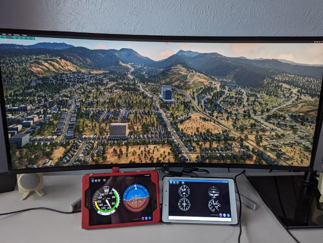

# XPlaneRemotePlugin
Plugin for the Android Flight Sim Remote Panel application

Please visit the application's home page for more information: 

https://baltazarstudios.com/flight-sim-remote-panel

Over the years, this application and the plugins have been verified and tested, on Windows OS, with:
- X-Plane v12
- X-Plane v11
- X-Plane v10
- X-Plane v9

Download Android application:

https://play.google.com/store/apps/details?id=org.baltazar.XPlaneRemotePlus2

------------------------------------------------------------------------------
# XPlaneRemotePlus2
Flight Sim Remote Panel application compiled for Windows OS.

You may need to install Microsoft VC redistributable package from here:

Flight Sim Remote Panel application

https://aka.ms/vs/17/release/vc_redist.x64.exe

