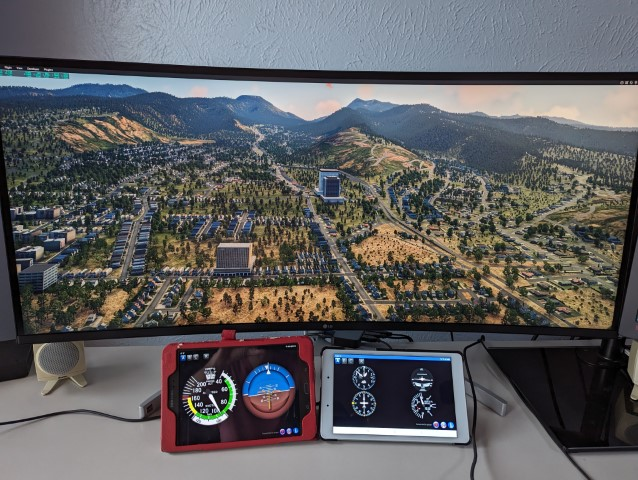

# Flight Sim Remote Panel 2

This repo contains plugins and aplications for XPlane Flight Sim Remote Panel.

Please visit the application's home page for more information:

https://baltazarstudios.com/flight-sim-remote-panel

The Android APK is in the APK directory. Side-load this APK into your Android device.

This is the app on the Google Play site:

https://play.google.com/store/apps/details?id=org.baltazar.XPlaneRemotePlus2

---

## App won't connect to X-Plane?

### **[Read the troubleshooting guide](https://gdevic.github.io/XPlaneRemotePlugin/docs/)** &nbsp;|&nbsp; **[Download as PDF](https://github.com/gdevic/XPlaneRemotePlugin/raw/master/docs/Remote-Panel-2-Connection-Help.pdf)**

The plugin listens on **TCP port 51000** on the computer running X-Plane. The guide walks
through it in the order that finds the fault fastest:

- Confirming the plugin loaded and claimed the port, from `Log.txt`
- Testing on the X-Plane computer first, to separate a plugin problem from a network one
- Firewall setup on Windows, macOS and Linux
- Finding the right IP address — X-Plane shows it under Settings &rarr; Network
- What each status message in the app means, and which step fixes it
- The Windows reserved-port-range problem, where `winnat` swallows port 51000 and the
  plugin fails with error 10013 instead of "already in use"

---

# XPlaneRemotePlugin
Plugins for various OS-es.

Over the years, this application and the plugins have been verified and tested on Windows OS with:
- X-Plane v12
- X-Plane v11
- X-Plane v10
- X-Plane v9

# XPlaneRemotePlus2
This is the application compiled for Windows OS.

You may need to install the latest Microsoft VC redistributable package from here:

https://aka.ms/vs/17/release/vc_redist.x64.exe

---

